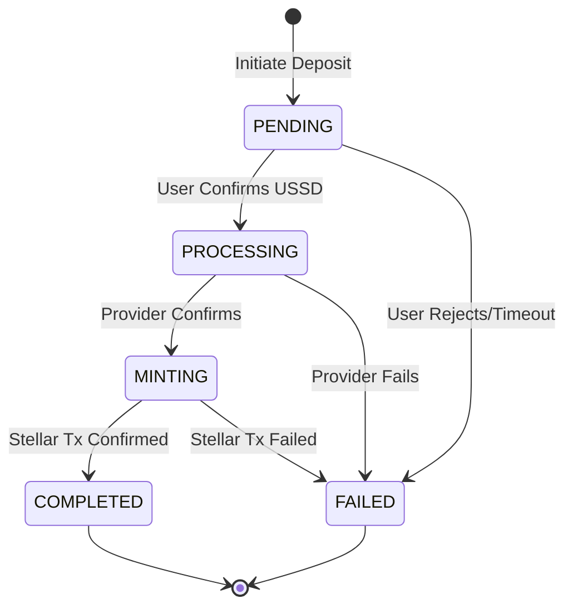

Deposits allow your users to fund their accounts using local mobile money providers (like MTN, Airtel, or Orange), which are then converted and minted as Stellar tokens (like USDC or local stablecoins) to their designated Stellar address.

## The Deposit Flow

The deposit process involves orchestrating a mobile money collection and a Stellar blockchain transaction.

<Steps>
  <Step title="Initiate Deposit">
    Your application initiates a deposit via an API call to the Bridge.
  </Step>
  <Step title="Collection Request">
    The Bridge creates a collection request with the local mobile money provider.
  </Step>
  <Step title="User Confirmation">
    The user receives a prompt on their phone (via USSD or STK push) to confirm the payment with their PIN.
  </Step>
  <Step title="Provider Confirmation">
    The mobile money provider confirms the successful payment to the Bridge via a webhook.
  </Step>
  <Step title="Token Minting">
    The Bridge mints the equivalent amount in Stellar tokens to the user's provided Stellar address.
  </Step>
  <Step title="Completion Notification">
    A webhook notifies your application that the deposit is complete and funds have been minted.
  </Step>
</Steps>

## State Machine



## Making a Deposit

To initiate a deposit, send a `POST` request to the `/v1/deposits` endpoint.

<Note>
  Always include an `Idempotency-Key` header to safely retry requests without double-charging your users.
</Note>

<CodeGroup>
```bash cURL
curl -X POST https://api.mobilemoney.dev/v1/deposits \
  -H "Authorization: Bearer YOUR_API_KEY" \
  -H "Content-Type: application/json" \
  -H "Idempotency-Key: dep_123456789" \
  -d '{
    "amount": "5000",
    "currency": "KES",
    "phone_number": "+254712345678",
    "provider": "M-PESA",
    "stellar_address": "GABCDEFGHIJKLMNOPQRSTUVWXYZ1234567890",
    "memo": "Dep123",
    "metadata": {
      "user_id": "usr_98765"
    }
  }'
```

```typescript TypeScript
import { MobileMoneyBridge } from '@mobilemoney/bridge-sdk';

const bridge = new MobileMoneyBridge('YOUR_API_KEY');

const deposit = await bridge.deposits.create({
  amount: '5000',
  currency: 'KES',
  phoneNumber: '+254712345678',
  provider: 'M-PESA',
  stellarAddress: 'GABCDEFGHIJKLMNOPQRSTUVWXYZ1234567890',
  memo: 'Dep123',
  metadata: {
    userId: 'usr_98765'
  }
}, {
  idempotencyKey: 'dep_123456789'
});

console.log(deposit.id); // dpt_abc123
```
</CodeGroup>

### Response

```json
{
  "id": "dpt_abc123",
  "status": "pending",
  "amount": "5000",
  "currency": "KES",
  "phone_number": "+254712345678",
  "provider": "M-PESA",
  "stellar_address": "GABCDEFGHIJKLMNOPQRSTUVWXYZ1234567890",
  "created_at": "2026-08-31T10:00:00Z"
}
```

## Error Scenarios

When dealing with mobile money deposits, expect certain common failure modes:

- **Insufficient Funds**: The user doesn't have enough balance in their mobile wallet.
- **Timeout**: The user fails to enter their PIN within the allowed window (typically 30-60 seconds).
- **User Cancelled**: The user actively rejected the prompt.
- **Invalid Phone Number**: The number is not registered for mobile money.

Ensure your application listens for `transaction.failed` webhooks to gracefully handle these states and inform the user.
