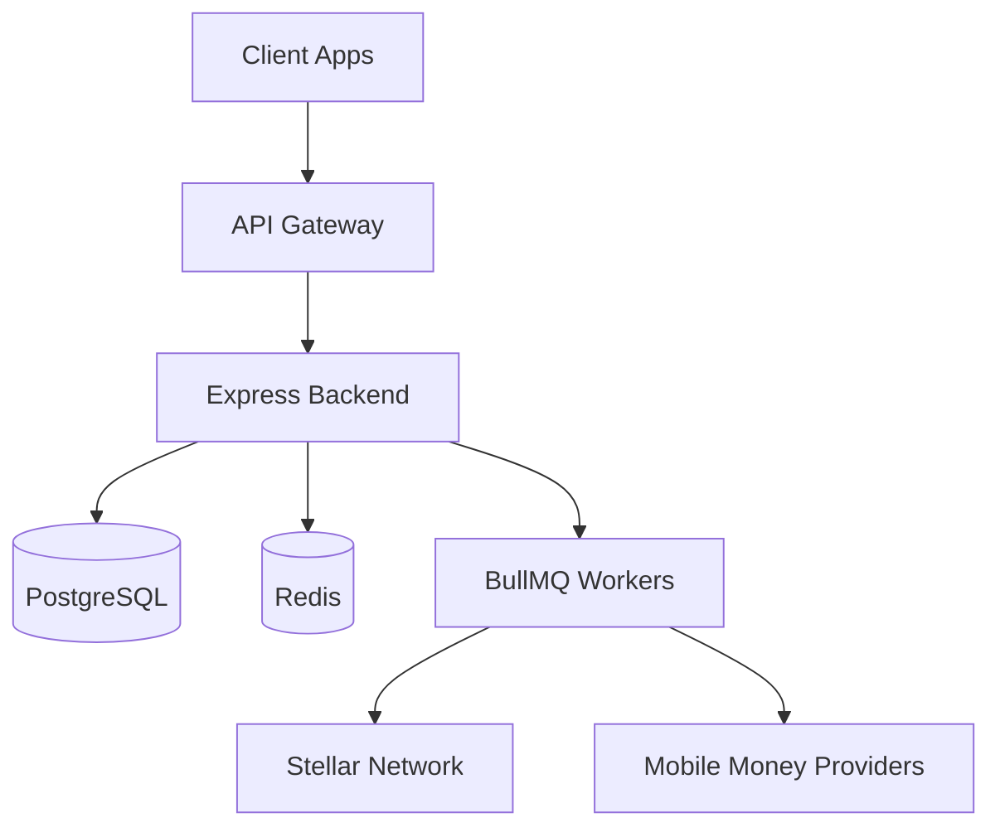

The Mobile Money platform is built for resilience, security, and high throughput.

```mermaid
graph TD
  Client[Client Apps] --> API[API Gateway]
  API --> Backend[Express Backend]
  Backend --> DB[(PostgreSQL)]
  Backend --> Cache[(Redis)]
  Backend --> Workers[BullMQ Workers]
  Workers --> Stellar[Stellar Network]
  Workers --> MoMo[Mobile Money Providers]
```
